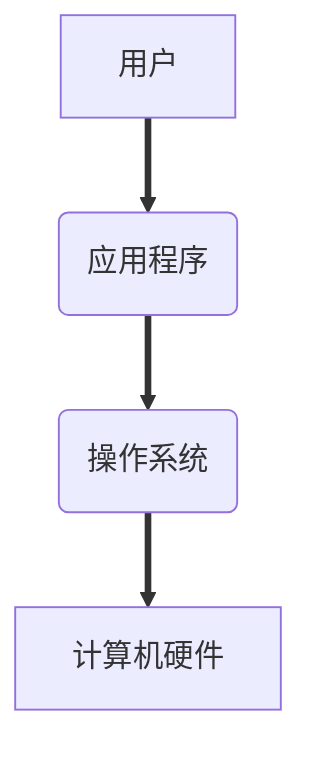

# Linux基础笔记

## 操作系统

#### 目标

* 了解**操作系统**及作用

### 01. 操作系统（Operation System，OS）

> 没有安装操作系统的计算机，通常被称为 **裸机**
>
> * 如果想在 **裸机** 上运行自己所编写的程序，就必须用**机器语言**（二进制）书写程序
> * 如果计算机上安装了操作系统，就可以在操作系统上安装支持的高级语言环境，用高级语言开发程序

#### 1.1 操作系统的作用

* 是现代计算机系统中 **最基本和最重要** 的系统软件
* 是 **配置在计算机硬件上的第一层软件**，是对硬件系统的首次扩展
* 主要作用是**管理好硬件设备**，并为用户和应用程序提供一个简单的接口，以便于使用(==直接控制各个不同的硬件进行工作==)
* 而其他的诸如编译程序、数据库管理系统，以及大量的应用软件，都直接依赖于操作系统的支持(==把操作硬件的代码封装成多个“**系统调用**”，供其他成员通过系统调用间接访问计算机的硬件。==)


#### 1.2 不同应用领域的主流操作系统

* 桌面操作系统
* 服务器操作系统
* 嵌入式操作系统
* 移动设备操作系统

##### 1> 桌面操作系统

* Windows 系列
  * 用户群体大
* macOS
  * 适合于开发人员
* Linux
  * 应用软件少

##### 2> 服务器操作系统

* Linux
  * 安全、稳定、免费
  * 占有率高
* Windows Server
  * 付费
  * 占有率低

##### 3> 嵌入式操作系统

* Linux

##### 4> 移动设备操作系统

* iOS
* Android（基于 `Linux`）

#### 1.3 虚拟机

虚拟机（Virtual Machine）指通过软件模拟的具有完整硬件系统功能的、运行在一个完全隔离环境中的完整计算机系统

* 虚拟系统通过生成现有操作系统的全新虚拟镜像，**==具有真实操作系统完全一样的功能==**
* 进入虚拟系统后，所有操作都是在这个全新的独立的虚拟系统里面进行，可以独立安装运行软件，保存数据，拥有自己的独立桌面，**==不会对真正的系统产生任何影====响==**
* 而且能够在现有系统与虚拟镜像之间灵活切换的一类操作系统

### 02. Linux 内核及发行版

#### 2.1 Linux 内核版本

* **内核（kernel）**是系统的心脏，是运行程序和管理像磁盘和打印机等硬件设备的核心程序，它提供了一个在裸设备与应用程序间的抽象层
* Linux 内核版本又分为 **稳定版** 和 **开发版**，两种版本是相互关联，相互循环
  * **稳定版**：具有工业级强度，可以广泛地应用和部署。新的稳定版相对于较旧的只是修正一些 bug 或加入一些新的驱动程序
  * **开发版**：由于要试验各种解决方案，所以变化很快
* 内核源码网址：http://www.kernel.org

> 所有来自全世界的对 Linux 源码的修改最终都会汇总到这个网站，由 Linus 领导的开源社区对其进行甄别和修改最终决定是否进入到 Linux 主线内核源码中

#### 2.2 Linux 发行版本

* **Linux 发行版（也被叫做 GNU/Linux 发行版）**通常包含了包括桌面环境、办公套件、媒体播放器、数据库等应用软件
* 常见的发行版本如下：
  * Ubuntu
  * Redhat
  * Fedora
  * openSUSE
  * Linux Mint
  * Debian
  * Manjaro
  * Mageia
  * CentOS
  * Arch

* 十大 Linux 服务器发行版排行榜：http://os.51cto.com/art/201612/526126.htm

> 在几乎每一份与 Linux 有关的榜单上，基于 Debian 的 Ubuntu 都占有一席之位。Canonical 的Ubuntu 胜过其他所有的 Linux 服务器发行版 ―― 从简单安装、出色的硬件发现，到世界级的商业支持，Ubuntu确立了难以企及的严格标准

### 03. Linux 的应用领域

#### 3.1 服务器领域

* Linux 在服务器领域的应用是其重要分支
* Linux 免费、稳定、高效等特点在这里得到了很好的体现
  * 早期因为维护、运行等原因同样受到了很大的限制
  * 近些年来 Linux 服务器市场得到了飞速的提升，尤其在一些高端领域尤为广泛

#### 3.2 嵌入式领域

* 近些年来 Linux 在嵌入式领域的应用得到了飞速的提高
* Linux 运行稳定、对网络的良好支持性、低成本，且可以根据需要进行软件裁剪，内核最小可以达到几百 KB 等特点，使其近些年来在嵌入式领域的应用得到非常大的提高

> 主要应用：**机顶盒**、**数字电视**、**网络电话**、**程控交换机**、**手机**、**PDA**、等都是其应用领域，得到了 Google、三星、摩托罗拉、NEC 等公司的大力推广

#### 3.3 个人桌面领域

* 此领域是传统 Linux 应用最薄弱的环节
* 传统 Linux 由于界面简单、操作复杂、应用软件少的缺点，一直被 Windows 所压制
* 近些年来随着 **Ubuntu**、**Fedora** 等优秀桌面环境的兴起，同时各大硬件厂商对其支持的加大，Linux 在个人桌面领域的占有率在逐渐的提高

> 在 Ubuntu 中玩 QQ


## Ubuntu 图形界面入门

#### 目标

* 熟悉 Ubuntu 图形界面的基本使用

### 01. Ubuntu 的任务栏


调整图标在任务栏的位置的方法已在上图中显示出来。

### 02. 窗口操作按钮


在Linux系统下，窗口操作按钮不同于windows在窗口的右上角，而是在左上角。,<br>其他有关窗口操作按钮的操作同windows相同。

### 03. 窗口菜单条


窗口菜单条只有将鼠标移至屏幕顶部的工具条后，才能显示该窗口对应的菜单选项。<br>同一时间激活的窗口只能有一个，所以同一时间也只能对一个应用程序的菜单栏进行操作。

## Linux 终端命令格式

#### 目标

* 了解终端命令格式
* 知道如何查阅终端命令帮助信息

### 01.常用Linux命令的基本使用

| 序号 | 命令           | 对应英文             | 作用                           |
| ---- | -------------- | -------------------- | ------------------------------ |
| 01   | ls             | list                 | 查看当前文件夹下的内容         |
| 02   | pwd            | print work directory | 查看当前所在文件夹或文件的地址 |
| 03   | cd [目录名]    | change directory     | 切换文件夹                     |
| 04   | touch [文件名] | touch                | 如果文件不存在，新建文件       |
| 05   | mkdir [目录名] | make directory       | 创建目录                       |
| 06   | rm [文件名]    | remove               | 删除指定的的文件名             |
| 07   | clear          | clear                | 清屏                           |

注意区分大小写<br>命令中的空格千万别忘了

>#### 小技巧
>
>- `ctrl + shift + =  `  ***放大***终端窗口的字体显示
>- `ctrl + -` ***缩小***终端窗口的字体显示

### 02. 终端命令格式

```bash
command [-options] [parameter]
```

说明：

* `command`：命令名，相应功能的英文单词或单词的缩写
* `[-options]`：选项，可用来对命令进行控制，也可以省略
* `parameter`：传给命令的参数，可以是 **零个**、**一个** 或者 **多个**

> `[]` 代表可选 []内的内容可有可无<br>rm -r [parameter] 删除目录<br>命令与参数之间必须要有空格

### 03. 查阅命令帮助信息（知道）

> 提示
>
> * 现阶段只需要 **知道** 通过以下两种方式可以查询命令的帮助信息
> * 先学习**常用命令**及**常用选项**的使用即可，工作中如果遇到问题可以借助 **网络搜索**

#### 3.1 `--help`

```bash
command --help
```

说明：

* 显示 `command` 命令的帮助信息

#### 3.2 man

```bash
man command
```

说明：

* 查阅 `command` 命令的使用手册

> `man` 是 **manual** 的缩写，是 Linux 提供的一个 **手册**，包含了绝大部分的命令、函数的详细使用说明

使用 `man` 时的操作键：

| 操作键   | 功能                 |
| -------- | -------------------- |
| 空格键   | 显示手册页的下一屏   |
| Enter 键 | 一次滚动手册页的一行 |
| b        | 回滚一屏             |
| f        | 前滚一屏             |
| q        | 退出                 |
| /word    | 搜索 **word** 字符串 |


## Linux 文件与目录命令

### Linux 文件（white）与目录（blue）的特点

+ Linux **文件**与**目录**名称最长可以有`256`个字符
+ 以 `.` 开头的文件为隐藏文件，需要用 `-a` 参数才能显示（`ls -a`）
+ **.** 代表当前目录(cd .)
+ **..** 代表上一级目录(cd ..)

### 01.目录操作命令

### **==pwd==**

- **功能**：显示当前工作目录。  
- **示例**：`pwd` 

### 切换目录 

#### **==cd==**

+ **功能**：切换当前工作目录。 

+ **用法**：`cd [目录路径]`   
+ **示例**：    
  + - `cd /etc`：切换到`/etc`目录。   
    - `cd ~`：切换到当前用户的家目录。` ~`代表home 。  
    - `cd -`：只能在最近两次工作目录之间来回切换。
    - `cd + 回车 ` ：切换到当前用户的家目录。
    - `cd .`：保持当前目录不变。
    - `cd ..`：切换到上级目录。
+ **相对路径和绝对路径**
  + **相对路径**：在输入路径时，最前面不是`/`或者`~`，表示相对**当前目录**所在的目录位置。
  + **绝对路径**：在输入路径时，最前面是`/`或者`~`，表示从**根目录**/**家目录**开始的具体目录位置。

### 查看目录内容

#### ==**ls**==

+ **功能**：列出当前目录或指定目录下的文件和子目录。   

+ **用法**：`ls [选项] [目录路径]`   

+ **常用选项**：    

  + `-a`：列出指定目录下的所有文件，包括隐藏文件。    

  + `-l`：以列表方式显示文件的详细信息。    

  +  `-h`：必须配合`-l`以人类可读的格式(kb)显示文件大小等信息。(查阅文件大小更加方便)   （ls -l -h）/ (ls -lh)

  +  `-R`：递归列出遇到的子目录。  

     > 以上选项可以联合使用（ls -lha）<br>且不计较顺序

+ **示例**：`ls -lh /home/user`     

+ **ls通配符的使用**<br>

  | 通配符 | 含义                                          | 示例                                                         |
  | ------ | --------------------------------------------- | ------------------------------------------------------------ |
  | *      | 代表任意个数个字符                            | `ls *.txt`：列出当前目录下所有以`.txt`结尾的文件。<br>`ls *`：列出当前目录下的所有文件和目录（不包括以`.`开头的隐藏文件）。 |
  | ？     | 代表任意一个字符，至少1个(也只能表示是出一个) | `ls file?.txt`：列出当前目录下文件名以`file`开头，紧接着是一个字符，并以`.txt`结尾的文件，如`file1.txt`、`fileA.txt`。 |
  | []     | 表示可以匹配字符组中的任意一个                | `ls file[1-3].txt`：列出当前目录下文件名以`file`开头，紧接着是1到3之间的任意一个数字，并以`.txt`结尾的文件，如`file1.txt`、`file2.txt`、`file3.txt`。<br>`ls file[a-c].txt`：列出当前目录下文件名以`file`开头，紧接着是a到c之间的任意一个字母，并以`.txt`结尾的文件，如`filea.txt`、`fileb.txt`、`filec.txt`。 |
  | [abc]  | 匹配a,b,c中的任意一个                         |                                                              |
  | [a-f]  | 匹配从a到f中的任意一个字符                    |                                                              |


### 创建与删除操作

#### **==mkdir==**

+ **功能**：创建新**目录**。 （**Linux下，同一目录中，文件与目录不可以同名**）  

+ **用法**：`mkdir [选项] [目录路径]`   

+ **常用选项**：    
  + `-p`：需要时创建目标目录的上层目录。   

+ **示例**：`mkdir -p /home/user/newdir/subdir`        

#### ==**touch**==

+ **功能**：

  + 创建新**文件**

  + 更新已有文件的访问和修改时间。   

+ **用法**：`touch [选项] [文件]`   

+ **常用选项**：   

  - `-a`：只更新访问时间。    

  + `-m`：只更新修改时间。    

  + -d`：使用指定的日期时间。   

-  **示例**：`touch newfile.txt`    

#### **==rm==**

+ **功能**：删除文件或目录。 **（使用rm命令要小心，因为文件删除后不能恢复，删除是直接从磁盘上删除）  **
+ **用法**：`rm [选项] [文件或目录]`   （也可使用通配符进行命令）
+ **常用选项**：    
+ `-f`：强制删除，忽略不存在的文件，无需提示。    
  
+ `-i`：删除前询问用户。    
  
+ `-r`或`-R`：递归删除。(删除文件夹时必须加此参数)  
+ **示例**：`rm -rf /home/user/olddir  `  `rm *1.txt   rm -r *  `     

#### rmdir

+ **功能**：删除空目录。   

+ **用法**：`rmdir [选项] [目录路径]`   

+ **常用选项**：    
  + `-p`：删除指定目录后，若该目录的上层目录已变成空目录，则将其一并删除。   -

+ **示例**：`rmdir -p /home/user/emptydir/parentdir`   


### 拷贝和移动文件

#### tree

+ **功能**：以树状结构显示目录内容。   

+ **用法**：`tree [选项] [目录路径]`   

+ **选项**：`-d` ,只显示目录，不显示文件

+ **示例**：`tree /home/user`     ## 文件操作命令     

#### cp

+ **功能**：复制文件或目录。   

+ **用法**：`cp [选项] [源文件] [目标文件或目录]`  （源文件也可以用“文件目录/文件名”来表示）

+ **常用选项**：    
  + `-a`：保留源文件的所有属性。   
  
  + `-f`：强行复制。   
  
  + **`-i`**：覆盖前询问用户。 （ 回答的时候 `y`表示`yes`,`n`表示`no`）
  
  + `-l`：创建硬连接。  
  + `-p`：保留源文件属性。    
  + `-R`或**`-r`**：递归处理。    
  +  `-s`：创建符号连接。    
  +  `-u`：只有在源文件比目标文件新或目标文件不存在时才复制。   
  
+  **示例**：`cp -a source.txt /home/user/backup/`     

#### mv

+  **功能**：移动文件或目录，或对文件或目录进行重命名。   
+ **用法**：`mv [选项] [源文件或目录] [目标文件或目录]`  
+ **常用选项**：   
  +  `-b`：覆盖前创建备份。    
  +  `-f`：直接覆盖。   
  + `-i`：覆盖前询问用户。    
  +  `-u`：只有在源文件比目标文件新或目标文件不存在时才移动。   
+ **示例**：`mv oldname.txt newname.txt`     

### du

+ **功能**：统计目录及文件的空间占用情况。   

+ **用法**：`du [选项] [文件或目录]`   

+  **常用选项**：    

   - `-s`：汇总统计。   

   + `-h`：以可读的格式显示。   

- **示例**：`du -sh /home/user`     

### 02.其他常用命令

### cat

+ **功能**：查看短文本文件内容。  
+  **用法**：`cat [文件]`     

### more   

+ **功能**：分页查看长文本文件内容。  
+  **用法**：`more [文件]`     

### head

+  **功能**：查看文件的开头部分。   
+ **用法**：`head [选项] [文件]`   
+ **常用选项**：    - `-n`：指定查看的行数。    

 ### tail  

- **功能**：查看文件的结尾部分。   
- **用法**：`tail [选项] [文件]`   
-  **常用选项**：    
  - `-n`：指定查看的行数。    
  -  `-f`：持续输出文件结尾内容。    

 ### chmod   

- **功能**：修改文件或目录的权限。  
- **用法**：`chmod [选项] [权限模式] [文件或目录]`   
-  **示例**：`chmod 777 file.txt`     

### chown  

- **功能**：修改文件或目录的所有者。   
- **用法**：`chown [选项] [所有者][:[组]] [文件或目录]`   
-  **示例**：`chown user:group file.txt`     

### find   

- **功能**：按照指定条件查找文件或目录。   
- **用法**：`find [查找路径] [寻找条件] [操作]`   
- **示例**：`find / -name "filename.txt"`   

### grep

+ **功能**：在文件中查找包含指定字符串的行。  
+  **用法**：`grep [选项] [字符串] [文件]`   
+  **常用选项**：   
  + `-n`：显示匹配行的行号。    
  +  `-r`：递归查找目录中的文件。   
  +  `-i`：忽略大小写。

### 自动补全

+ 在敲出`文件`/`目录`/`命令`的前几个字母之后，按下`Tab`键
  + 如果输入的没有歧义，系统会自动补全
  + 如果还存在其他`文件`/`目录`/`命令`，再按一下`Tab`键，系统会提示可能存在的其他命令

### 曾经使用过的命令

+ 按`上`/`下`光标键可以在曾经使用过的命令之间来回切换
+ 如果想要退出选择，并且不想执行当前选中的命令，可以按`ctrl + c`

## 远程管理常用命令

##### 目标

* 关机/重启
  * `shutdown`
* 查看或配置网卡信息
  * `ifconfig`
  * `ping`
* 远程登录和复制文件
  * `ssh`
  * `scp`

### 01. 关机/重启

| 序号 | 命令               | 对应英文 | 作用           |
| ---- | ------------------ | -------- | -------------- |
| 01   | shutdown 选项 时间 | shutdown | 关机／重新启动 |

#### 1.1 `shutdown`

* `shutdown` 命令可以 **安全** **关闭** 或者 **重新启动系统**

| 选项 | 含义     |
| ---- | -------- |
| -r   | 重新启动 |

> 提示：
>
> * **不指定选项和参数**，默认表示 **1 分钟**之后 **关闭电脑**
> * 远程维护服务器时，最好不要关闭系统，而应该重新启动系统

* 常用命令示例

```bash
# 重新启动操作系统，其中 now 表示现在
$ shutdown -r now

# 立刻关机，其中 now 表示现在
$ shutdown now

# 系统在今天的 20:25 会关机
$ shutdown 20:25

# 系统再过十分钟后自动关机
$ shutdown +10

# 取消之前指定的关机计划
$ shutdown -c
```

### 02. 查看或配置网卡信息

| 序号 | 命令        | 对应英文                      | 作用                              |
| ---- | ----------- | ----------------------------- | --------------------------------- |
| 01   | ifconfig    | configure a network interface | 查看/配置计算机当前的网卡配置信息 |
| 02   | ping ip地址 | ping                          | 检测到目标 ip地址 的连接是否正常  |

#### 2.1 网卡 和 IP 地址

#### 网卡

* 网卡是一个专门负责网络通讯的硬件设备
* **IP 地址**是设置在网卡上的地址信息

> 我们可以把 **电脑** 比作 **电话**，**网卡** 相当于 **SIM 卡**，**IP 地址** 相当于 **电话号码**

#### IP 地址

* **每台联网的电脑上**都有 **IP 地址**，**是保证电脑之间正常通讯的重要设置**

> 注意：每台电脑的 IP 地址不能相同，否则会出现 IP 地址冲突，并且没有办法正常通讯
>
> 提示：有关 **IP 地址**的详细内容，在就业班会详细讲解！

#### 2.2 `ifconfig`

* `ifconfig` 可以查看／配置计算机当前的网卡配置信息

```bash
# 查看网卡配置信息
$ ifconfig

# 查看网卡对应的 IP 地址
$ ifconfig | grep inet
```

> 提示：一台计算机中有可能会有一个 **物理网卡** 和 **多个虚拟网卡**，在 Linux 中物理网卡的名字通常以 `ensXX` 表示

* `127.0.0.1` 被称为 **本地回环/环回地址**，一般用来测试本机网卡是否正常

#### 2.3 `ping`

```bash
# 检测到目标主机是否连接正常
$ ping IP地址

# 检测本地网卡工作正常
$ ping 127.0.0.1
```

* `ping` 一般用于检测当前计算机到目标计算机之间的网络 **是否通畅**，**数值越大，速度越慢**

> * `ping` 的工作原理与潜水艇的声纳相似，`ping` 这个命令就是取自 **声纳的声音** 
> * 网络管理员之间也常将 `ping` 用作动词 —— **ping 一下计算机X，看他是否开着**

原理：网络上的机器都有 **唯一确定的 IP 地址**，我们给**目标 IP 地址**发送一个数据包，对方就要返回一个数据包，根据返回的数据包以及时间，我们可以确定目标主机的存在

> 提示：在 Linux 中，想要终止一个终端程序的执行，绝大多数都可以使用 `CTRL + C`

### 03. 远程登录和复制文件

| 序号 | 命令                                              | 对应英文     | 作用           |
| ---- | ------------------------------------------------- | ------------ | -------------- |
| 01   | ssh 用户名@ip                                     | secure shell | 关机／重新启动 |
| 02   | scp 用户名@ip:文件名或路径 用户名@ip:文件名或路径 | secure copy  | 远程复制文件   |

#### 3.1 `ssh` 基础（重点）

在 Linux 中 SSH 是 **非常常用** 的工具，通过 **SSH 客户端** 我们可以连接到运行了 **SSH 服务器** 的远程机器上


* **SSH 客户端**是一种使用 `Secure Shell（SSH）` 协议连接到远程计算机的软件程序
* `SSH` 是目前较可靠，**专为远程登录会话和其他网络服务** 提供安全性的协议
  * 利用 `SSH 协议` 可以有效**防止远程管理过程中的信息泄露**
  * 通过 `SSH 协议` 可以对所有传输的数据进行加密，也能够防止 DNS 欺骗和 IP 欺骗
* `SSH` 的另一项优点是传输的数据可以是经过压缩的，所以可以加快传输的速度

##### 1) 域名 和 端口号

###### 域名

* 由一串 **用点分隔** 的名字组成，例如：`www.itcast.cn`
* 是 **IP 地址** 的别名，方便用户记忆

###### 端口号

* **IP 地址**：通过 **IP 地址** 找到网络上的 **计算机**
* **端口号**：通过 **端口号** 可以找到 **计算机上运行的应用程序**
  * **SSH 服务器** 的默认端口号是 `22`，如果是默认端口号，在连接的时候，可以省略

* 常见服务端口号列表：

| 序号 | 服务       | 端口号 |
| ---- | ---------- | ------ |
| 01   | SSH 服务器 | 22     |
| 02   | Web 服务器 | 80     |
| 03   | HTTPS      | 443    |
| 04   | FTP 服务器 | 21     |

> 提示：有关 **端口号**的详细内容，在就业班会详细讲解！

##### 2) SSH 客户端的简单使用

```bash
ssh [-p port] user@remote
```

* `user` 是在远程机器上的用户名，如果不指定的话默认为当前用户
* `remote` 是远程机器的地址，可以是 **IP**／**域名**，或者是 **后面会提到的别名**
* `port` 是 **SSH Server 监听的端口**，如果不指定，就为默认值 `22`

> 提示：
>
> * 使用 `exit` 退出当前用户的登录
>
> 注意：
>
> * `ssh` 这个终端命令只能在 `Linux` 或者 `UNIX` 系统下使用
> * 如果在 `Windows` 系统中，可以安装 `PuTTY` 或者 `XShell` 客户端软件即可
>
> 提示：
>
> * 在工作中，SSH 服务器的端口号很有可能**不是 22**，如果遇到这种情况就需要使用 `-p` 选项，指定正确的端口号，否则无法正常连接到服务器

##### 3) Windows 下 SSH 客户端的安装

* `Putty` http://www.chiark.greenend.org.uk/~sgtatham/putty/latest.html
* `XShell` http://xshellcn.com

> 建议从官方网站下载正式的安装程序

#### 3.2 `scp`（掌握）

* scp 就是 `secure copy`，是一个在 Linux 下用来进行 **远程拷贝文件** 的命令
* 它的**地址格式与 ssh 基本相同**，**需要注意的是**，在指定端口时用的是大写的 `-P` 而不是小写的


```bash
# 把本地当前目录下的 01.py 文件 复制到 远程 家目录下的 Desktop/01.py
# 注意：`:` 后面的路径如果不是绝对路径，则以用户的家目录作为参照路径
scp -P port 01.py user@remote:Desktop/01.py

# 把远程 家目录下的 Desktop/01.py 文件 复制到 本地当前目录下的 01.py
scp -P port user@remote:Desktop/01.py 01.py

# 加上 -r 选项可以传送文件夹
# 把当前目录下的 demo 文件夹 复制到 远程 家目录下的 Desktop
scp -r demo user@remote:Desktop

# 把远程 家目录下的 Desktop 复制到 当前目录下的 demo 文件夹
scp -r user@remote:Desktop demo
```

| 选项 | 含义                                                         |
| ---- | ------------------------------------------------------------ |
| -r   | 若给出的源文件是目录文件，则 scp 将递归复制该目录下的所有子目录和文件，目标文件必须为一个目录名 |
| -P   | 若远程 SSH 服务器的端口不是 22，需要使用大写字母 -P 选项指定端口 |

> 注意：
>
> * `scp` 这个终端命令只能在 `Linux` 或者 `UNIX` 系统下使用
> * 如果在 `Windows` 系统中，可以安装 `PuTTY`，使用 `pscp` 命令行工具或者安装 `FileZilla` 使用 `FTP` 进行文件传输

#### `FileZilla`

* 官方网站：https://www.filezilla.cn/download/client
* `FileZilla` 在传输文件时，使用的是 `FTP 服务` 而不是 `SSH 服务`，因此端口号应该设置为 `21`

#### 3.3 SSH 高级（知道）

* 免密码登录
* 配置别名

> 提示：有关 SSH 配置信息都保存在用户家目录下的 `.ssh` 目录下

##### 1）免密码登录

###### 步骤

* 配置公钥
  * 执行 `ssh-keygen` 即可生成 SSH 钥匙，一路回车即可
* 上传公钥到服务器
  * 执行 `ssh-copy-id -p port user@remote`，可以让远程服务器记住我们的公钥

###### 示意图

> 非对称加密算法
>
> * 使用 **公钥** 加密的数据，需要使用 **私钥** 解密
> * 使用 **私钥** 加密的数据，需要使用 **公钥** 解密

##### 2) 配置别名

每次都输入 `ssh -p port user@remote`，时间久了会觉得很麻烦，特别是当 `user`, `remote` 和 `port` 都得输入，而且还不好记忆

而 **配置别名** 可以让我们进一步偷懒，譬如用：`ssh mac` 来替代上面这么一长串，那么就在 `~/.ssh/config` 里面追加以下内容：

```
Host mac
    HostName ip地址
    User itheima
    Port 22
```

**保存之后，即可用 `ssh mac` 实现远程登录了，`scp` 同样可以使用**

## 用户权限相关命令

##### 目标

* **用户** 和 **权限** 的基本概念
* **用户管理** 终端命令
* **组管理** 终端命令
* **修改权限** 终端命令

### 01. **用户** 和 **权限** 的基本概念

#### 1.1 基本概念

* **用户** 是 Linux 系统工作中重要的一环，用户管理包括 **用户** 与 **组** 管理
* 在 Linux 系统中，不论是由本机或是远程登录系统，每个系统都**必须拥有一个账号**，并且**对于不同的系统资源拥有不同的使用权限**
* 在 Linux 中，可以指定 **每一个用户** 针对 **不同的文件或者目录** 的 **不同权限**
* 对 **文件／目录** 的权限包括：

| 序号 | 权限 |  英文  | 缩写 | 数字代号 |
| :--: | :--: | :----: | :--: | :------: |
|  01  |  读  |  read  |  r   |    4     |
|  02  |  写  | write  |  w   |    2     |
|  03  | 执行 | excute |  x   |    1     |

#### 1.2 组

* 为了方便用户管理，提出了 **组** 的概念，如下图所示

* 在实际应用中，可以预先针对 **组** 设置好权限，然后 **将不同的用户添加到对应的组中**，从而**不用依次为每一个用户设置权限**

#### 1.3 ls -l 扩展

* `ls -l` 可以查看文件夹下文件的详细信息，从左到右依次是：

  * **权限**，第 1 个字符如果是 `d` 表示目录
  * **硬链接数**，通俗地讲，就是有多少种方式，可以访问到当前目录／文件
  * **拥有者**，家目录下 文件／目录 的拥有者通常都是当前用户
  * **组**，在 Linux 中，很多时候，会出现组名和用户名相同的情况，后续会讲
  * **大小**
  * **时间**
  * **名称**

#### 1.4 `chmod` 简单使用（重要）

* `chmod` 可以修改 **用户／组** 对 **文件／目录** 的权限
* 命令格式如下：

```bash
chmod +/-rwx 文件名|目录名
```

> 提示：以上方式会一次性修改 `拥有者` / `组` 权限，有关 `chmod` 的高级用法，后续会讲

#### 1.5 超级用户

* Linux 系统中的 `root` 账号通常 **用于系统的维护和管理**，对操作系统的所有资源 **具有所有访问权限**
* 在大多数版本的 Linux 中，都不推荐 **直接使用 root 账号登录系统**
* 在 Linux 安装的过程中，系统会自动创建一个用户账号，而这个默认的用户就称为“标准用户”

##### sudo

* `su` 是 `substitute user` 的缩写，表示 **使用另一个用户的身份**
* `sudo` 命令用来以其他身份来执行命令，预设的身份为 `root`
* 用户使用 `sudo` 时，必须先输入密码，之后有 **5 分钟的有效期限**，超过期限则必须重新输入密码

> 若其未经授权的用户企图使用 `sudo`，则会发出警告邮件给管理员

### 02. **组管理** 终端命令

> 提示：**创建组** / **删除组** 的终端命令都需要通过 `sudo` 执行

| 序号 | 命令                      | 作用                      |
| ---- | ------------------------- | ------------------------- |
| 01   | groupadd 组名             | 添加组                    |
| 02   | groupdel 组名             | 删除组                    |
| 03   | cat /etc/group            | 确认组信息                |
| 04   | chgrp -R 组名 文件/目录名 | 递归修改文件/目录的所属组 |

> 提示：
>
> * 组信息保存在 `/etc/group` 文件中
> * `/etc` 目录是专门用来保存 **系统配置信息** 的目录

* 在实际应用中，可以预先针对 **组** 设置好权限，然后 **将不同的用户添加到对应的组中**，从而**不用依次为每一个用户设置权限**

##### 演练目标

1. 在 `python` 用户的桌面文件夹下创建 `Python学习` 目录
2. 新建 `dev` 组
3. 将 `Python学习` 目录的组修改为 `dev`

### 03. **用户管理** 终端命令

> 提示：**创建用户** / **删除用户** / **修改其他用户密码** 的终端命令都需要通过 `sudo` 执行

#### 3.1 创建用户／设置密码／删除用户

| 序号 | 命令                           | 作用         | 说明                                                         |
| ---- | ------------------------------ | ------------ | ------------------------------------------------------------ |
| 01   | useradd -m -g 组 新建用户名    | 添加新用户   | <ul><li>-m 自动建立用户家目录</li><li>-g 指定用户所在的组，否则会建立一个和同名的组</li></ul> |
| 02   | passwd 用户名                  | 设置用户密码 | 如果是普通用户，直接用 passwd 可以修改自己的账户密码         |
| 03   | userdel -r 用户名              | 删除用户     | -r 选项会自动删除用户家目录                                  |
| 04   | cat /etc/passwd \| grep 用户名 | 确认用户信息 | 新建用户后，用户信息会保存在 /etc/passwd 文件中              |

> 提示：
>
> * 创建用户时，如果忘记添加 `-m` 选项指定新用户的家目录 —— 最简单的方法就是**删除用户，重新创建**
> * 创建用户时，默认会创建一个和**用户名**同名的**组名**
> * 用户信息保存在 `/etc/passwd` 文件中

#### 3.2 查看用户信息

| 序号 | 命令        | 作用                       |
| ---- | ----------- | -------------------------- |
| 01   | id [用户名] | 查看用户 UID 和 GID 信息   |
| 02   | who         | 查看当前所有登录的用户列表 |
| 03   | whoami      | 查看当前登录用户的账户名   |

##### passwd 文件

`/etc/passwd` 文件存放的是用户的信息，由 6 个分号组成的 7 个信息，分别是

1. 用户名
2. 密码（x，表示加密的密码）
3. UID（用户标识）
4. GID（组标识）
5. 用户全名或本地帐号
6. 家目录
7. 登录使用的 Shell，就是登录之后，使用的终端命令，`ubuntu` 默认是 `dash`

##### usermod

* `usermod` 可以用来设置 **用户** 的 **主组** ／ **附加组** 和 **登录 Shell**，命令格式如下：
* **主组**：通常在新建用户时指定，在 `etc/passwd` 的第 4 列 **GID 对应的组**
* **附加组**：在 `etc/group` 中最后一列表示该组的用户列表，用于指定 **用户的附加权限**

> 提示：设置了用户的附加组之后，需要重新登录才能生效！

```bash
# 修改用户的主组（passwd 中的 GID）
usermod -g 组 用户名

# 修改用户的附加组
usermod -G 组 用户名

# 修改用户登录 Shell
usermod -s /bin/bash 用户名
```

> 注意：默认使用 `useradd` 添加的用户是没有权限使用 `sudo` 以 `root` 身份执行命令的，可以使用以下命令，将用户添加到 `sudo` 附加组中

```bash
usermod -G sudo 用户名
```

##### which（重要）

> 提示
>
> * `/etc/passwd` 是用于保存用户信息的文件
> * `/usr/bin/passwd` 是用于修改用户密码的程序

* `which` 命令可以查看执行命令所在位置，例如：

```bash
which ls

# 输出
# /bin/ls

which useradd

# 输出
# /usr/sbin/useradd
```

##### `bin` 和 `sbin`

* 在 `Linux` 中，绝大多数可执行文件都是保存在 `/bin`、`/sbin`、`/usr/bin`、`/usr/sbin`
* `/bin`（`binary`）是二进制执行文件目录，主要用于具体应用
* `/sbin`（`system binary`）是系统管理员专用的二进制代码存放目录，主要用于系统管理
* `/usr/bin`（`user commands for applications`）后期安装的一些软件
* `/usr/sbin`（`super user commands for applications`）超级用户的一些管理程序

> 提示：
>
> * `cd` 这个终端命令是内置在系统内核中的，没有独立的文件，因此用 `which` 无法找到 `cd` 命令的位置

#### 3.3 切换用户

| 序号 | 命令        | 作用                   | 说明                                     |
| ---- | ----------- | ---------------------- | ---------------------------------------- |
| 01   | su - 用户名 | 切换用户，并且切换目录 | - 可以切换到用户家目录，否则保持位置不变 |
| 02   | exit        | 退出当前登录账户       |                                          |

* `su` 不接用户名，可以切换到 `root`，但是不推荐使用，因为不安全
* `exit` 示意图如下：

### 04. 修改文件权限

| 序号 | 命令  | 作用       |
| ---- | ----- | ---------- |
| 01   | chown | 修改拥有者 |
| 02   | chgrp | 修改组     |
| 03   | chmod | 修改权限   |

* 命令格式如下：

```bash
# 修改文件|目录的拥有者
chown 用户名 文件名|目录名

# 递归修改文件|目录的组
chgrp -R 组名 文件名|目录名

# 递归修改文件权限
chmod -R 755 文件名|目录名
```

* `chmod` 在设置权限时，可以简单地使用三个数字分别对应 **拥有者** ／ **组** 和 **其他** 用户的权限

```bash
# 直接修改文件|目录的 读|写|执行 权限，但是不能精确到 拥有者|组|其他
chmod +/-rwx 文件名|目录名
```

* 常见数字组合有（`u`表示用户／`g`表示组／`o`表示其他）：
  * `777` ===> `u=rwx,g=rwx,o=rwx` 
  * `755` ===> `u=rwx,g=rx,o=rx`
  * `644` ===> `u=rw,g=r,o=r`

##### `chmod` 演练目标

1. 将 `01.py` 的权限修改为 `u=rwx,g=rx,o=r` 
2. 将 `123.txt` 的权限修改为 `u=rw,g=r,o=-` 
3. 将 `test` 目录以及目录下的 **所有** 文件权限修改为 `u=rwx,g=rwx,o=rx` 

## 系统信息相关命令

* 本节内容主要是为了方便通过远程终端维护服务器时，查看服务器上当前 **系统日期和时间** ／ **磁盘空间占用情况** ／ **程序执行情况**
* 本小结学习的终端命令基本都是查询命令，通过这些命令对系统资源的使用情况有个了解

##### 目标

* 时间和日期
  * `date`
  * `cal`
* 磁盘和目录空间
  * `df`
  * `du`
* 进程信息
  * `ps`
  * `top`
  * `kill`

### 01. 时间和日期

| 序号 | 命令 | 作用                                             |
| ---- | ---- | ------------------------------------------------ |
| 01   | date | 查看系统时间                                     |
| 02   | cal  | `calendar` 查看日历，`-y` 选项可以查看一年的日历 |

### 02. 磁盘信息

| 序号 | 命令           | 作用                              |
| ---- | -------------- | --------------------------------- |
| 01   | df -h          | `disk free` 显示磁盘剩余空间      |
| 02   | du -h [目录名] | `disk usage` 显示目录下的文件大小 |

* 选项说明

| 参数 | 含义                       |
| ---- | -------------------------- |
| -h   | 以人性化的方式显示文件大小 |

### 03. 进程信息

* 所谓 **进程**，通俗地说就是 **当前正在执行的一个程序**

| 序号 | 命令               | 作用                                  |
| ---- | ------------------ | ------------------------------------- |
| 01   | ps aux             | `process status` 查看进程的详细状况   |
| 02   | top                | 动态显示运行中的进程并且排序          |
| 03   | kill [-9] 进程代号 | 终止指定代号的进程，`-9` 表示强行终止 |

> `ps` 默认只会显示当前用户通过终端启动的应用程序

* `ps` 选项说明

| 选项 | 含义                                     |
| ---- | ---------------------------------------- |
| a    | 显示终端上的所有进程，包括其他用户的进程 |
| u    | 显示进程的详细状态                       |
| x    | 显示没有控制终端的进程                   |

> 提示：使用 `kill` 命令时，最好只终止由当前用户开启的进程，而不要终止 `root` 身份开启的进程，否则可能导致系统崩溃

>* 要退出 `top` 可以直接输入 `q`

## 其他命令

##### 目标

* 查找文件
  * `find`
* 软链接
  * `ln`
* 打包和压缩
  * `tar`
* 软件安装
  * `apt-get`

### 01. 查找文件

* `find` 命令功能非常强大，通常用来在 **特定的目录下** **搜索** 符合条件的文件

| 序号 | 命令                     | 作用                                            |
| ---- | ------------------------ | ----------------------------------------------- |
| 01   | find [路径] -name "*.py" | 查找指定路径下扩展名是 `.py` 的文件，包括子目录 |

* 如果省略路径，表示在当前文件夹下查找
* 之前学习的通配符，在使用 `find` 命令时同时可用
* 有关 `find` 的高级使用，在就业班会讲

#### 演练目标

* 1. 搜索桌面目录下，文件名包含 `1` 的文件

```bash
find -name "*1*"
```

* 2. 搜索桌面目录下，所有以 `.txt` 为扩展名的文件

```bash
find -name "*.txt"
```

* 3. 搜索桌面目录下，以数字 `1` 开头的文件

```bash
find -name "1*"
```

### 02. 软链接

| 序号 | 命令                          | 作用                                                         |
| ---- | ----------------------------- | ------------------------------------------------------------ |
| 01   | ln -s 被链接的源文件 链接文件 | 建立文件的软链接，用通俗的方式讲**类似于** Windows 下的**快捷方式** |

* 注意：

* 1. 没有 `-s` 选项建立的是一个 **硬链接文件** 

    * 两个文件占用相同大小的硬盘空间，**工作中几乎不会建立文件的硬链接**

* 2. **源文件要使用绝对路径**，不能使用相对路径，这样可以方便移动链接文件后，仍然能够正常使用

#### 演练目标

* 1. 将桌面目录下的 `01.py` **移动**到 `demo/b/c` 目录下

* 2. 在桌面目录下新建 `01.py` 的 **软链接** `FirstPython`

    * 分别使用 **相对路径** 和 **绝对路径** 建立 `FirstPython` 的软链接

* 3. 将 `FirstPython` **移动**到 `demo` 目录下，对比使用 **相对路径** 和 **绝对路径** 的区别

#### 硬链接简介（知道）

* 在使用 `ln` 创建链接时，如果没有 `-s` 选项，会创建一个 **硬链接**，而不是软链接

##### 硬链接演练

* 1. 在 `~/Desktop/demo` 目录下建立 `~/Desktop/demo/b/c/01.py` 的硬链接 `01_hard`
* 2. 使用 `ls -l` 查看文件的**硬链接数**（硬链接——有多少种方式可以访问文件或者目录）
* 3. 删除 `~/Desktop/demo/b/c/01.py`，并且使用 `tree` 来确认 `demo` 目录下的三个链接文件

##### 文件软硬链接的示意图

> 在 Linux 中，**文件名** 和 **文件的数据** 是分开存储的

* 提示：
  * 在 Linux 中，只有文件的 `硬链接数 == 0` 才会被删除
  * 使用 `ls -l` 可以查看一个文件的硬链接的数量
  * 在日常工作中，几乎不会建立文件的硬链接，知道即可

### 03. 打包压缩

* **打包压缩** 是日常工作中备份文件的一种方式
* 在不同操作系统中，常用的打包压缩方式是不同的
  * `Windows` 常用 `rar`
  * `Mac` 常用 `zip`
  * `Linux` 常用 `tar.gz`

#### 3.1 打包 ／ 解包

* `tar` 是 Linux 中最常用的 **备份**工具，此命令可以 **把一系列文件** 打包到 **一个大文件中**，也可以把一个 **打包的大文件恢复成一系列文件**
* `tar` 的命令格式如下：

```bash
# 打包文件
tar -cvf 打包文件.tar 被打包的文件／路径...

# 解包文件
tar -xvf 打包文件.tar
```

* `tar` 选项说明

| 选项 | 含义                                                         |
| ---- | ------------------------------------------------------------ |
| c    | 生成档案文件，创建打包文件                                   |
| x    | 解开档案文件                                                 |
| v    | 列出归档解档的详细过程，显示进度                             |
| f    | 指定档案文件名称，f 后面一定是 .tar 文件，所以必须放选项最后 |

> 注意：`f` 选项必须放在最后，其他选项顺序可以随意

##### 打包解包演练

1. 删除桌面下的所有内容
2. 在桌面下新建三个空白文件 `01.py`、`02.py`、`03.py`
3. 将这三个文件打一个 `py.tar` 的包
4. 新建 `tar` 目录，并且将 `py.tar` 移动到 `tar` 目录下
5. 解包 `py.tar`

#### 3.2 压缩／解压缩

##### 1) `gzip`

* `tar` 与 `gzip` 命令结合可以使用实现文件 **打包和压缩**
  * `tar` 只负责打包文件，但不压缩
  * 用 `gzip` 压缩 `tar` 打包后的文件，其扩展名一般用 `xxx.tar.gz`

> 在 `Linux` 中，最常见的压缩文件格式就是 `xxx.tar.gz`

* 在 `tar` 命令中有一个选项 **-z** 可以调用 `gzip`，从而可以方便的实现压缩和解压缩的功能

* 命令格式如下：

```bash
# 压缩文件
tar -zcvf 打包文件.tar.gz 被压缩的文件／路径...

# 解压缩文件
tar -zxvf 打包文件.tar.gz

# 解压缩到指定路径
tar -zxvf 打包文件.tar.gz -C 目标路径
```

| 选项 | 含义                                           |
| ---- | ---------------------------------------------- |
| -C   | 解压缩到指定目录，注意：要解压缩的目录必须存在 |

##### 2) `bzip2(two)`

* `tar` 与 `bzip2` 命令结合可以使用实现文件 **打包和压缩**（用法和 `gzip` 一样）
  * `tar` 只负责打包文件，但不压缩，
  * 用 `bzip2` 压缩 `tar` 打包后的文件，其扩展名一般用 `xxx.tar.bz2`

* 在 `tar` 命令中有一个选项 **-j** 可以调用 `bzip2`，从而可以方便的实现压缩和解压缩的功能

* 命令格式如下：

```bash
# 压缩文件
tar -jcvf 打包文件.tar.bz2 被压缩的文件／路径...

# 解压缩文件
tar -jxvf 打包文件.tar.bz2
```

### 04. 软件安装

### 4.1 通过 apt 安装／卸载软件

* apt 是 `Advanced Packaging Tool`，是 Linux 下的一款安装包管理工具
* 可以在终端中方便的 **安装**／**卸载**／**更新软件包**

```bash
# 1. 安装软件
$ sudo apt install 软件包

# 2. 卸载软件
$ sudo apt remove 软件名

# 3. 更新已安装的包
$ sudo apt upgrade 
```

#### 安装演练

```bash
# 一个小火车提示
$ sudo apt install sl

# 一个比较漂亮的查看当前进程排名的软件
$ sudo apt install htop
```

### 4.2 配置软件源

* 如果希望在 `ubuntu` 中安装软件，**更加快速**，可以通过设置**镜像源**，选择一个访问网速更快的服务器，来提供软件下载／安装服务
* 提示：更换服务器之后，需要一个相对比较长时间的更新过程，需要耐心等待。更新完成后，再安装软件都会从新设置的服务器下载软件了


